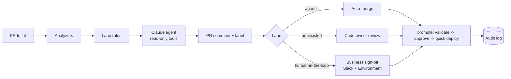

# sfdc-agentops

A governed, AI-first CI/CD pipeline for Salesforce, with a Claude-powered release agent written in Go.

Every pull request is sorted into one of three **lanes**. The lane decides who has to approve the change before it can ship:

| Lane | Example changes | Who acts |
| --- | --- | --- |
| **Agentic** | Reports, dashboards, list views, layouts, labels | Auto-merges to `int` once checks pass |
| **AI-assisted** | Apex, triggers, LWC, flows, fields | An engineer approves; Claude reviews |
| **Human-in-the-loop** | Profiles, permission sets, sharing, deletions, security settings, SOX-scoped objects, hotfixes | Engineer approval **and** business sign-off |

Deterministic rules decide the lane and any blocking findings. Claude explains them and looks for anything else, but it **cannot lower a lane or unblock a merge**. Every decision goes into a hash-chained audit log that can serve as SOX evidence.



## What's in the repo

| Path | What it does |
| --- | --- |
| `cmd/agentops` | The CLI: `analyze`, `eval`, `audit append/verify/export`, `metrics`, `notify`, `rollback-plan` |
| `internal/analyzers` | 10 deterministic rules (below) |
| `internal/lanes` | Lane classifier and escalation rules |
| `internal/agent` | Hand-written Claude tool-use loop on the [Anthropic Go SDK](https://github.com/anthropics/anthropic-sdk-go): tool allowlist, budgets, file jail |
| `internal/audit` | Append-only, SHA-256 hash-chained JSONL log with tamper detection |
| `internal/metrics` | DORA metrics and lane share from the audit log |
| `.github/workflows/pr-gate.yml` | Analyze, comment, label, block, business sign-off, auto-merge, audit |
| `.github/workflows/promote.yml` | Delta, snapshot, check-only deploy, approval, quick deploy, back-promotion |
| `.github/workflows/rollback.yml` | Restores the pre-deploy snapshot and deletes what the deploy added |
| `evals/cases` | 16 seeded changes with the expected lane and findings |
| `force-app` | A small sample app (Invoice object, Apex + test, permission set, report, layout) to deploy |

## Analyzer rules

| Rule | Severity | Catches |
| --- | --- | --- |
| CONF001 | high | Unresolved merge conflict markers |
| DEP001 | high | A permission set, profile or layout that references a field, class, object or record type that isn't in the repo or the org inventory |
| DEP002 | high | A reference to a component that the same change deletes |
| PERM001 | medium | A profile change |
| PERM002 | high | Duplicate profile or permission set entries (a bad line-based merge) |
| DEL001 | medium | Deleted components or destructive manifests |
| API001 | high / low | API version at or below the retired level (30.0) / below the team floor |
| APEX001 | high | Apex class or trigger with no test class that references it |
| APEX002 | medium | Hardcoded record IDs in Apex or flows |
| FLOW001 | medium | Flow DML elements without a fault path |

## Quick start (no org or API key needed)

```bash
make test     # unit tests, including the agent loop against a fake Claude API
make eval     # runs the seeded eval cases
make demo     # prints the PR comment for a permission set that references a missing field
```

With a key, `ANTHROPIC_API_KEY=... ./bin/agentops analyze --base origin/int --agent` adds the Claude review to the comment.

## Evals

```
Eval results: 16/16 cases pass
Lane accuracy 100% · Finding recall 100% · Finding precision 100%
```

These cases were written alongside the rules, so 100% is expected: it shows the rules do what they claim and guards against regressions. It does not measure real-world accuracy. Add real incidents from your own pipeline as new cases (`scripts/gen_evals.py`, or a folder with `case.yaml` plus the files). `agentops eval --agent` also reports Claude token use and latency per case.

## Setup on free orgs

See [docs/setup.md](docs/setup.md). The short version: three free Developer Edition orgs (QA, UAT, production), JWT auth secrets in GitHub Environments, a public GitHub repo, and optionally an Anthropic API key and a Slack webhook.

## Demo scenarios

`scripts/demo-branches.sh` creates 15 one-commit branches, one per scenario: each lane, each blocking rule, the warnings, a hotfix and a large-change escalation. Use `--push` to push them and open the PRs with `gh`, and `--clean` to delete them.

## Demo (2 minutes)

1. Open a reports-only PR into `int`. It is labeled `lane:agentic` and auto-merges.
2. Open a PR where a permission set grants a field that doesn't exist. The check fails, and the comment explains the fix.
3. Open a profile change. It is labeled `lane:human-in-the-loop`, a Slack message asks for sign-off, and the job waits for a business approver.
4. Merge to `uat`. The workflow validates with tests, waits for approval, then quick-deploys the validated job.
5. Run `agentops audit verify`, edit one line of the log, and run it again to show the tamper check failing.

## Design notes

- **Rules set the lane, the model explains it.** A model should never be able to reduce its own oversight.
- **The agent has no deploy tool.** Deploys happen only in workflow steps behind GitHub Environments.
- **What was approved is what ships.** The deploy is a quick deploy of the job ID that was validated before sign-off.
- **The agent fails open for advice, never for control.** If Claude is down, the review is marked unavailable and the gates are unchanged.

More detail: [branching](docs/branching.md) · [security](docs/security.md) · [Gearset / Copado mapping](docs/tooling.md)

## Limits

- Deleted metadata and field data cannot be restored by rollback. This is why deletions are always human-in-the-loop.
- The dependency check covers permission sets, profiles and layouts in the repo. For references in orgs that aren't source-tracked, add them to `.agentops/org-inventory.txt` or let the agent run `query_dependencies`.
- APEX001 checks that a test class references the code. It does not measure coverage; the check-only deploy with `RunLocalTests` does that.

MIT licensed.
